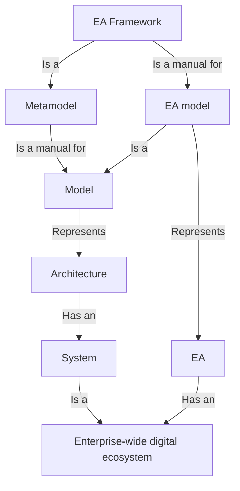

# test diagram

```mermaid
flowchart TD
  Metamodel[Metamodel]
  Framework[EA Framework]
  Model[Model]
  EAModel[EA model]
  Architecture[Architecture]
  EA[EA]
  System[System]
  Ecosystem[Enterprise‑wide digital ecosystem]

  Framework -->|Is a| Metamodel
  Metamodel -->|Is a manual for| Model
  Framework -->|Is a manual for| EAModel
  EAModel -->|Is a| Model

  Model -->|Represents| Architecture
  EAModel -->|Represents| EA

  Architecture -->|Has an| System
  EA -->|Has an| Ecosystem

  System -->|Is a| Ecosystem
```
